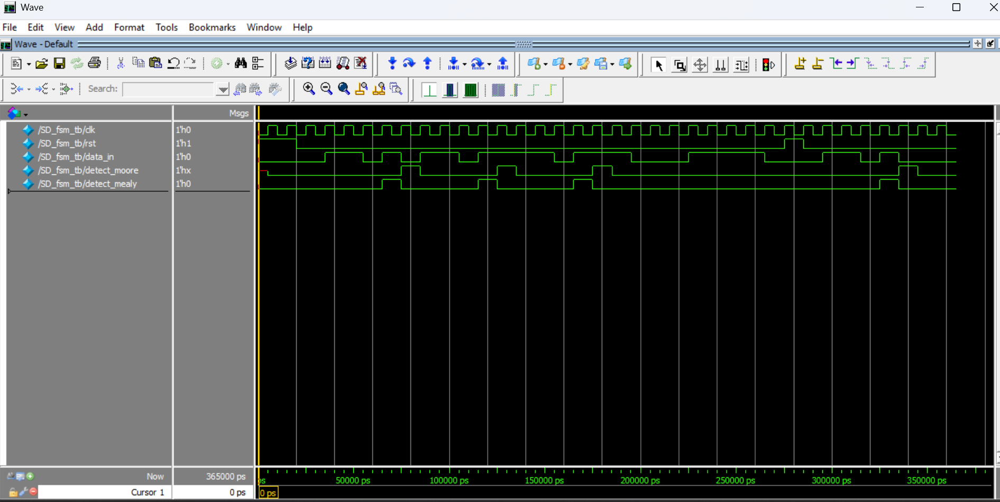
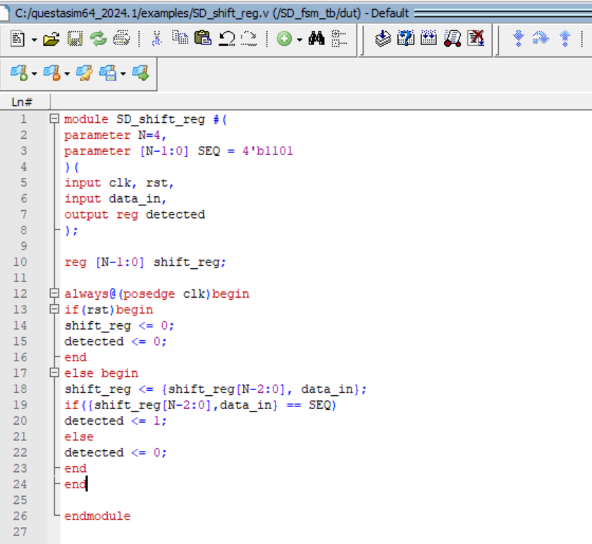
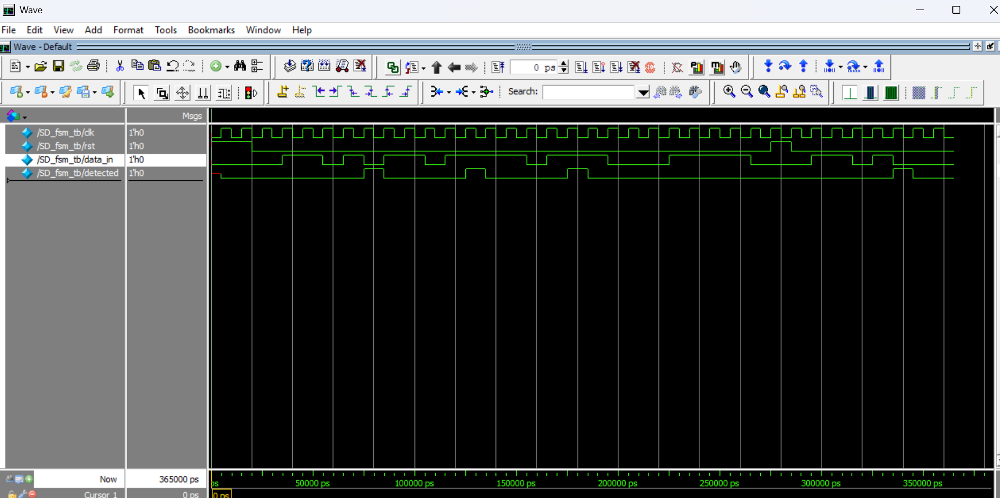

# Parameterized Sequence Detector (Verilog RTL)

## Overview
This project implements a **Sequence Detector in Verilog and explores two design approaches:

**1) FSM-based Sequence Detector (Moore/Mealy)**

**2) Parameterized Shift Register Based Detector**

The goal of this project was to **implement an FSM-based sequence detectors** and **study the limitations of design and propose a more flexible and reusable RTL solution**.

### Problem Statement
A sequence detector identifies a specific bit pattern from a serial input stream.
#### Example sequence:
1011
#### Example input stream:
1101011011
The output signal should assert when the sequence 1011 appears in the input.

### Approach 1: FSM-Based Sequence Detector
Sequence detectors are commonly implemented using Finite State Machines.
For example, detecting 1011 requires a state machine with states representing partial sequence matches.

#### Typical state progression:
S0 → S1 → S2 → S3 → S4

Where:

S0 : Initial state

S1 : Detected 1

S2 : Detected 10

S3 : Detected 101

S4 : Sequence 1011 detected

## Output simulation of fsm

#### Limitation
*FSM implementations are sequence-specific.*

If the sequence changes (for example 1011 → 1101), the State diagram and State transitions must be redesigned.
This reduces design flexibility.

### Approach 2: Parameterized Sequence Detector (Proposed)

To overcome the FSM limitation, a shift register based sliding window detector was implemented.

#### Architecture
data_in → Shift Register → Comparator → detected

The shift register stores the last N input bits, and these bits are continuously compared with the target sequence.

#### Example

#### Sequence to detect:
1011
#### Shift register progression:
0001
0010
0101
1011 → detected

#### Parameterized RTL Design
The sequence and its length are defined using parameters.

#### Example:
#### parameter N = 4;
#### parameter [N-1:0] SEQ = 4'b1011;

This allows detecting different sequences without modifying the RTL code.
Example:

SEQ = 1011

SEQ = 1101

SEQ = 0110

## Detection Latency Issue

During simulation, a one clock cycle delay in detection was observed.
This occurs because non-blocking assignments (<=) update registers after the clock edge, so the comparator uses the previous value of the shift register.

### Solution:
Instead of comparing:

*shift_reg == SEQ*

The design compares the next shift register value:

*{shift_reg[N-2:0], data_in} == SEQ*

This ensures the detection signal is asserted in the correct clock cycle.

### Output Simulation of shift_reg

Example waveform:

The design was verified using QuestaSim.

Observed signals:
clk
data_in
shift_reg
detected

## Tools Used:

*1) Verilog HDL*

*2) QuestaSim*

### Future Improvements
Possible extensions: Overlapping vs Non-overlapping sequence detection

Detection of multiple sequences

SystemVerilog testbench

Functional coverage

### Author
#### Awaiz Logde
#### M.Tech Semiconductor Chip Design
#### RTL Design / Digital Design
